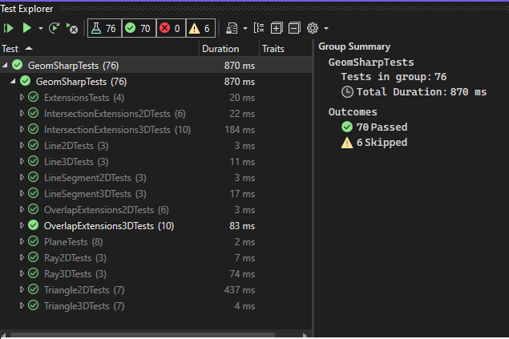

# geom_sharp

GeomSharp is a 2D (and 3D) geometry library for C#, based on .Net Framework 4.8

TODO: complete primitive tests, 
	  add build script and github action to build and test before PR merge, 
	  add build status tags on the README, 
	  add deployment action and its tag

## Definition

**Containment**: one shape is completely contained inside another shape (including its borders). 
For example, a point is contained inside a triagle if it is 

**Intersection**: one shape crosses another, splitting it into two shapes.
In 2D, two lines crossing each other, or having one point in common without being parallel.
In 3D, the lines (or shapes) do not belong to the same plane, and cross each other. 

**Overlap**: one shape shares a portion of its area with another.
In 2D, two lines are parallel to each other, and have at least one point in common.
In 3D, the two shapes are on the same plane, and one shape's surface lays on top of another - part of it (overlap) or completely (equality or containment).
For triangles and polygons, the Overlap also include cases of adjacency (one+ edge in common) and touch (one point lying over the other shape's border)

TODO: add definitions of "adjacency" and "touch" (one edge touches, now handled in Overlap).

## Latest test run

## Data Structures
Legend: :heavy_check_mark: done, :arrow_forward: in progress, :x: not done, :test_tube: tested

| 2D | 3D | Utils | 
| - | - | - | 
| :heavy_check_mark: :test_tube: Point | :heavy_check_mark: :test_tube: Point | :heavy_check_mark: Angle | 
| :heavy_check_mark: :test_tube: Vector | :heavy_check_mark: :test_tube: Vector | :x: Rotation | 
| :heavy_check_mark: :test_tube: Line | :heavy_check_mark: :test_tube: Line | :x: Translation | 
| :heavy_check_mark: :test_tube: Ray | :heavy_check_mark: :test_tube: Ray | :x: Transformation | 
| :heavy_check_mark: :test_tube: LineSegment | :heavy_check_mark: :test_tube: LineSegment |  | 
| :x: Polyline | :x: Polyline |  | 
| :heavy_check_mark: :test_tube: Triangle | :heavy_check_mark: :test_tube: Triangle |  | 
| :x: Polygon | :x: Polygon |  | 
| | :heavy_check_mark: :test_tube: Plane |  | 
| | :x: Polyhedron |  | 

## Algorithms

Legend: :heavy_check_mark: done, :arrow_forward: in progress, :x: not done, :test_tube: tested

| Category | SubCategory | Classes Involved |
| - | - | - |
| 2D | |
| | Containment | | 
| | | :heavy_check_mark: :test_tube: Line/Point| 
| | | :heavy_check_mark: :test_tube: Ray/Point | 
| | | :heavy_check_mark: :test_tube: Segment/Point | 
| | | :heavy_check_mark: :test_tube: Triangle/Point | 
| | | :x: Polyline/Point | 
| | | :x: Polygon/Point | 
| | Intersection | |
| | | :heavy_check_mark: :test_tube: Line/Line| 
| | | :heavy_check_mark: :test_tube: Line/Ray | 
| | | :heavy_check_mark: :test_tube:Line/Segment | 
| | | :heavy_check_mark: :test_tube: Ray/Ray | 
| | | :heavy_check_mark: :test_tube: Ray/Segment | 
| | | :heavy_check_mark: :test_tube: Segment/Segment | 
| | | :heavy_check_mark: :test_tube: Triangle/Triangle | 
| | | :heavy_check_mark: :test_tube: Triangle/Line | 
| | | :heavy_check_mark: :test_tube: Triangle/Ray | 
| | | :heavy_check_mark: :test_tube: Triangle/Segment | 
| | | :x: Polyline/Line | 
| | | :x: Polyline/Ray | 
| | | :x: Polyline/Segment | 
| | | :x: Polyline/Polyline |
| | | :x: Polyline/Triangle |
| | | :x: Polygon/Line | 
| | | :x: Polygon/Ray | 
| | | :x: Polygon/Segment | 
| | | :x: Polygon/Polyline | 
| | | :x: Polygon/Polygon | 
| | | :x: Polygon/Triangle | 
| | Overlap | |
| | | :heavy_check_mark: :test_tube: Line/Line| 
| | | :heavy_check_mark: :test_tube: Line/Ray | 
| | | :heavy_check_mark: :test_tube: Line/Segment | 
| | | :heavy_check_mark: :test_tube: Ray/Ray | 
| | | :heavy_check_mark: :test_tube: Ray/Segment | 
| | | :heavy_check_mark: :test_tube: Segment/Segment | 
| | | :heavy_check_mark: :test_tube: Triangle/Triangle | 
| | | :heavy_check_mark: :test_tube: Triangle/Line | 
| | | :heavy_check_mark: :test_tube: Triangle/Ray | 
| | | :heavy_check_mark: :test_tube: Triangle/Segment | 
| | | :x: Polyline/Line | 
| | | :x: Polyline/Ray | 
| | | :x: Polyline/Segment | 
| | | :x: Polyline/Polyline |
| | | :x: Polyline/Triangle |
| | | :x: Polygon/Line | 
| | | :x: Polygon/Ray | 
| | | :x: Polygon/Segment | 
| | | :x: Polygon/Polyline | 
| | | :x: Polygon/Polygon | 
| | | :x: Polygon/Triangle | 
| | Touch | |
| | | :heavy_check_mark: :test_tube: Triangle/Triangle | 
| | Adjacency | |
| | | :heavy_check_mark: :test_tube: Triangle/Triangle | 
| 3D | | |
| | Containment | |
| | | :heavy_check_mark: :test_tube: Line/Point| 
| | | :heavy_check_mark: :test_tube: Ray/Point | 
| | | :heavy_check_mark: :test_tube: Segment/Point | 
| | | :heavy_check_mark: :test_tube: Plane/Point | 
| | | :heavy_check_mark: :test_tube: Plane/Segment | 
| | | :heavy_check_mark: :test_tube: Triangle/Point | 
| | | :x: Polyline/Point | 
| | | :x: Polygon/Point | 
| | Projection | |
| | | :heavy_check_mark: :test_tube: ProjectOnto (Point 3D -> 3D) | 
| | | :heavy_check_mark: :test_tube: VerticalProjectOnto (Point 3D -> 3D) | 
| | | :heavy_check_mark: :test_tube: Evaluate (Point 3D -> 3D along an axis) | 
| | | :heavy_check_mark: :test_tube: ProjectInto (Point 3D -> 2D) | 
| | Intersection | |
| | | :heavy_check_mark: :test_tube: Line/Line| 
| | | :heavy_check_mark: :test_tube: Line/Ray | 
| | | :heavy_check_mark: :test_tube: Line/Segment | 
| | | :heavy_check_mark: :test_tube: Ray/Ray | 
| | | :heavy_check_mark: :test_tube: Ray/Segment | 
| | | :heavy_check_mark: :test_tube: Segment/Segment | 
| | | :heavy_check_mark: :test_tube: Plane/Plane | 
| | | :heavy_check_mark: :test_tube: Plane/Line | 
| | | :heavy_check_mark: :test_tube: Plane/Ray | 
| | | :heavy_check_mark: :test_tube: Plane/Segment | 
| | | :heavy_check_mark: :test_tube: Plane/Triangle | 
| | | :heavy_check_mark: :test_tube: Triangle/Triangle | 
| | | :heavy_check_mark: :test_tube: Triangle/Line | 
| | | :heavy_check_mark: :test_tube: Triangle/Ray | 
| | | :heavy_check_mark: :test_tube: Triangle/Segment | 
| | | :x: Polyline/Line | 
| | | :x: Polyline/Ray | 
| | | :x: Polyline/Segment | 
| | | :x: Polyline/Polyline |
| | | :x: Polyline/Triangle |
| | | :x: Polygon/Line | 
| | | :x: Polygon/Ray | 
| | | :x: Polygon/Segment | 
| | | :x: Polygon/Polyline | 
| | | :x: Polygon/Polygon | 
| | | :x: Polygon/Triangle | 
| | Overlap | |
| | | :heavy_check_mark: :test_tube: Line/Line| 
| | | :heavy_check_mark: :test_tube: Line/Ray | 
| | | :heavy_check_mark: :test_tube: Line/Segment | 
| | | :heavy_check_mark: :test_tube: Ray/Ray | 
| | | :heavy_check_mark: :test_tube: Ray/Segment | 
| | | :heavy_check_mark: :test_tube: Segment/Segment | 
| | | :heavy_check_mark: :test_tube: Plane/Plane | 
| | | :heavy_check_mark: :test_tube: Plane/Line | 
| | | :heavy_check_mark: :test_tube: Plane/Ray | 
| | | :heavy_check_mark: :test_tube: Plane/Segment | 
| | | :heavy_check_mark: :test_tube: Plane/Triangle | 
| | | :heavy_check_mark: :test_tube: Triangle/Triangle | 
| | | :heavy_check_mark: :test_tube: Triangle/Line | 
| | | :heavy_check_mark: :test_tube: Triangle/Ray | 
| | | :heavy_check_mark: :test_tube: Triangle/Segment | 
| | | :x: Polyline/Line | 
| | | :x: Polyline/Ray | 
| | | :x: Polyline/Segment | 
| | | :x: Polyline/Polyline |
| | | :x: Polyline/Triangle |
| | | :x: Polygon/Line | 
| | | :x: Polygon/Ray | 
| | | :x: Polygon/Segment | 
| | | :x: Polygon/Polyline | 
| | | :x: Polygon/Polygon | 
| | | :x: Polygon/Triangle | 
| | Touch | |
| | | :x: :heavy_check_mark: :test_tube: Triangle/Triangle | 
| | Adjacency | |
| | | :x: :heavy_check_mark: :test_tube: Triangle/Triangle | 

